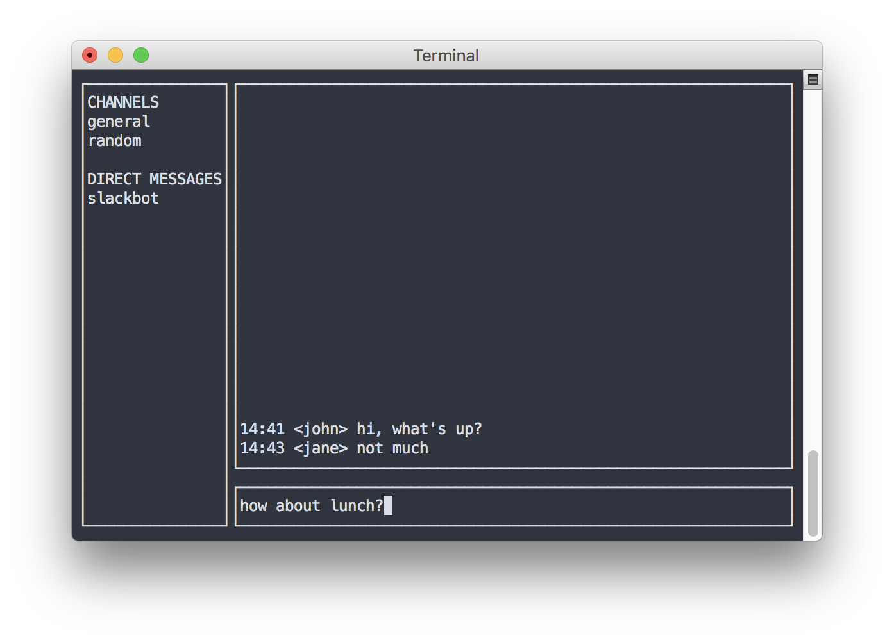

# tui: Terminal UI for Go

[](https://travis-ci.org/marcusolsson/tui-go)
[](https://godoc.org/github.com/marcusolsson/tui-go)
[](https://goreportcard.com/report/github.com/marcusolsson/tui-go)
[](LICENSE)

A UI library for terminal applications.

tui (pronounced _tooey_) provides a higher-level programming model for building rich terminal applications. It lets you build layout-based user interfaces that (should) gracefully handle resizing for you.

_IMPORTANT:_ tui-go is still in an experimental phase so please don't use it for anything other than experiments, yet.

**Update**: I created tui-go as an experiment because I wanted a simpler way of creating terminal-based user interfaces. It has since then become a project, with all the work that comes with it. While it's been really fun, unfortunately I'm no longer able to maintain this project. 

Since I started working on tui-go, a number of similar projects have popped up. One that I think shows great promise is [rivo/tview](https://github.com/rivo/tview), which embodies much of what I envisioned for tui-go. I highly recommend trying it out!

Thanks all of you who have contributed and supported tui-go!



## Installation

```
go get github.com/marcusolsson/tui-go
```

## Usage

```go
package main

import "github.com/marcusolsson/tui-go"

func main() {
	box := tui.NewVBox(
		tui.NewLabel("tui-go"),
	)

	ui, err := tui.New(box)
	if err != nil {
		panic(err)
	}
	ui.SetKeybinding("Esc", func() { ui.Quit() })

	if err := ui.Run(); err != nil {
		panic(err)
	}
}
```

## Getting started

If you want to know what it is like to build terminal applications with tui-go, check out some of the [examples](example).

Documentation is available at [godoc.org](https://godoc.org/github.com/marcusolsson/tui-go).

Make sure you check out some of the [projects using tui-go](https://godoc.org/github.com/marcusolsson/tui-go?importers).

Once you've gotten started developing your first application with tui-go, you might be interested in learning about common [patterns](https://github.com/marcusolsson/tui-go/wiki/Patterns) or how you can [debug](https://github.com/marcusolsson/tui-go/wiki/Debugging) your applications.

## Related projects

tui-go is mainly influenced by [Qt](https://www.qt.io/) and offers a similar programming model that has been adapted to Go and the terminal.

For an overview of the alternatives for writing terminal user interfaces, check out [this article](https://appliedgo.net/tui/) by [AppliedGo](https://appliedgo.net/).

## License

tui-go is released under the [MIT License](LICENSE).

## Contact

If you're interested in chatting with users and contributors, join
[#tui-go](https://gophers.slack.com/messages/tui-go) on
the [Gophers Slack](https://gophers.slack.com).
If you're not already a part of the Slack workspace, you can join
[here](https://invite.slack.golangbridge.org/). If you prefer a lower-bandwidth
interface, see [this
article](https://get.slack.help/hc/en-us/articles/201727913-Connect-to-Slack-over-IRC-and-XMPP)
on connecting to Slack via IRC or XMPP.
