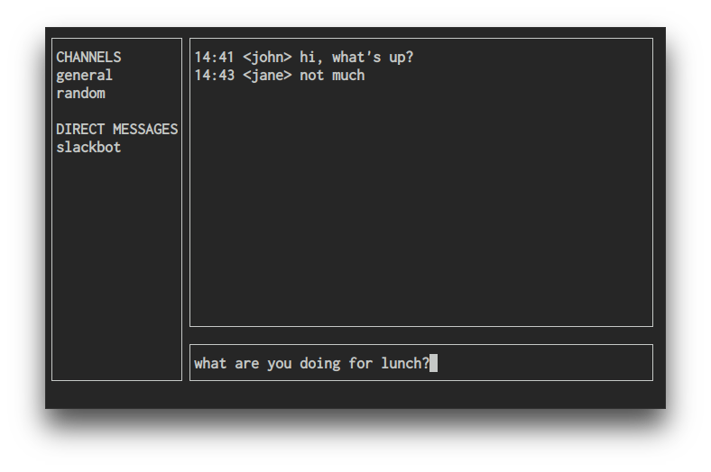

# tui

[](https://godoc.org/github.com/marcusolsson/tui-go)
[](https://goreportcard.com/report/github.com/marcusolsson/tui-go)
[](LICENSE)


A UI library for terminal applications.

tui-go provides a higher-level programming model for building rich terminal
applications. It lets you build layout-based user interfaces that (should)
gracefully handle resizing for you.



## Status

This project is highly experimental and will change a lot. Use at your own risk.

## Installation

```
go get github.com/marcusolsson/tui-go
```

## Example


```go
package main

import "github.com/marcusolsson/tui-go"

func main() {
	channels := tui.NewVerticalBox(
		tui.NewLabel("general"),
		tui.NewLabel("random"),
	)

	messages := tui.NewVerticalBox(
		tui.NewLabel("slackbot"),
	)

	sidebar := tui.NewVerticalBox(
		tui.NewLabel("CHANNELS"),
		channels,
		tui.NewLabel(""),
		tui.NewLabel("DIRECT MESSAGES"),
		messages,
	)
	sidebar.SetBorder(true)
	sidebar.SetSizePolicy(tui.Minimum, tui.Expanding)

	history := tui.NewVerticalBox()
	history.SetBorder(true)
	history.SetSizePolicy(tui.Expanding, tui.Expanding)

	for _, m := range []string{"hi, what's up?", "not much"} {
		b := tui.NewHorizontalBox(
			tui.NewLabel("john:"), tui.NewLabel(m),
		)
		b.SetPadding(1)

		history.Append(b)
	}

	input := tui.NewEntry()
	inputBox := tui.NewHorizontalBox(input)
	inputBox.SetBorder(true)
	inputBox.SetSizePolicy(tui.Expanding, tui.Minimum)

	chat := tui.NewVerticalBox(history, inputBox)
	chat.SetSizePolicy(tui.Expanding, tui.Expanding)

	input.OnSubmit(func(e *tui.Entry) {
		b := tui.NewHorizontalBox(
			tui.NewLabel("john:"), tui.NewLabel(e.Text()),
		)
		b.SetPadding(1)

		history.Append(b)

		input.SetText("")
	})

	root := tui.NewHorizontalBox(sidebar, chat)
	root.SetSizePolicy(tui.Expanding, tui.Expanding)

	if err := tui.New(root).Run(); err != nil {
		panic(err)
	}
}
```
